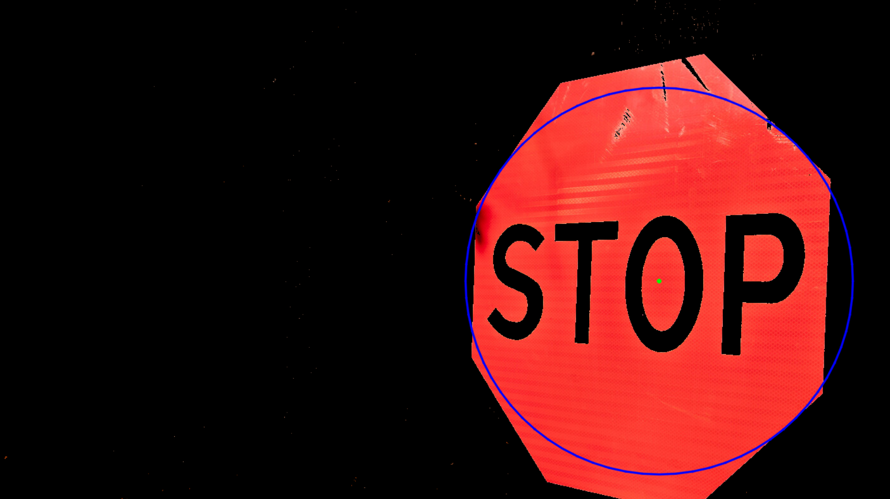

# Определение цветов в HSV и обнаружение кругов с OpenCV

## Описание
Программа обрабатывает изображение, определяет заданные диапазоны цветов в HSV и находит круговые объекты с помощью OpenCV.

## Возможности
- Загружает изображение (`stop.png`).
- Преобразует его в цветовое пространство HSV.
- Создаёт маску для обнаружения красных оттенков.
- Применяет побитовые операции для наложения маски.
- Использует размытие и метод HoughCircles для поиска кругов.
- Отображает обработанные изображения.

## Результат работы программы:

